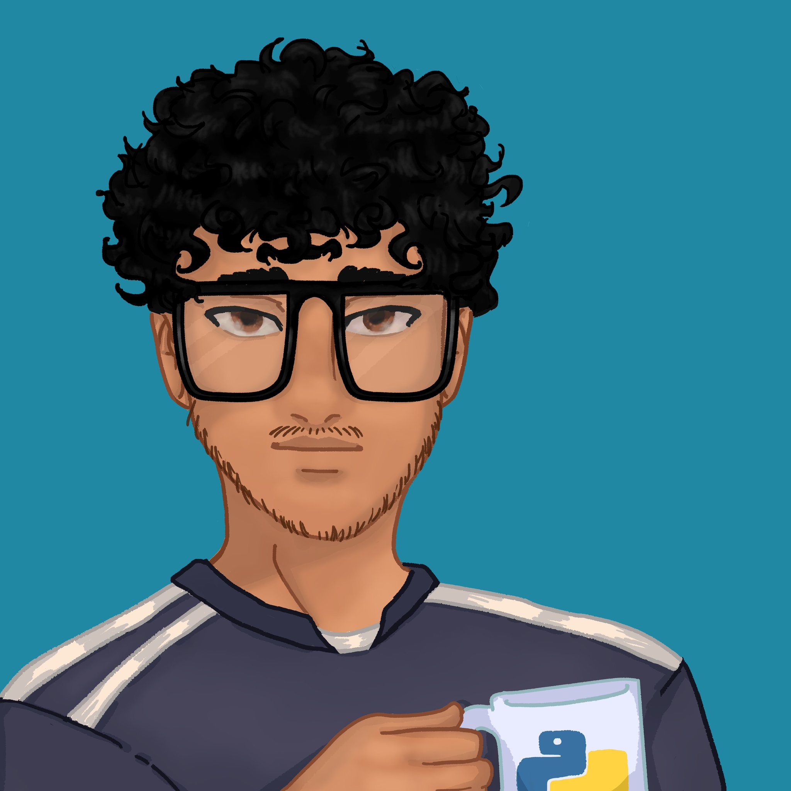

# Hello World, Welcome to my profile

<!-- I'm Lucas and I was born in 2000. I'm Brazilian and I'm from the countryside of Rio Grande do Norte. I've been studying Information Systems at the Federal University of Rio Grande do Norte (UFRN) since 2022 and my focus is on Back-end development, although I'm also curious about the mobile world. Currently, I'm focusing on learning Python language for web development using the Django framework. My greatest virtue is my responsibility towards my goals and I hope to contribute to the dev community with my studies. -->

  

      

          
      

      

          
I'm Lucas and I was born in 2000. I'm Brazilian and I'm from the countryside of Rio Grande do Norte. I've been studying Information Systems at the Federal University of Rio Grande do Norte (UFRN) since 2022 and my focus is on Back-end development, although I'm also curious about the mobile world. Currently, I'm focusing on learning Python language for web development using the Django and DRF.
          At present, I have the exciting opportunity to work as a backend developer at Labens, where I am involved in challenging projects and engaged in continuous learning. I also contribute to extension activities at the Casa do Artesão in Caicó, applying my skills to support the local community.
          My greatest virtue is my responsibility towards my goals and I hope to contribute to the dev community with my studies.
          

      

  

___

  <a href="https://github.com/mts-lucas">
  
  

  
##

 

    
  
  
  
  
  
  
  
  
  
  
  
  
  
  
  
  
  
___

<!-- ### :calling: Contacts: -->

 
  
  
   

  
   
 <!--  -->

